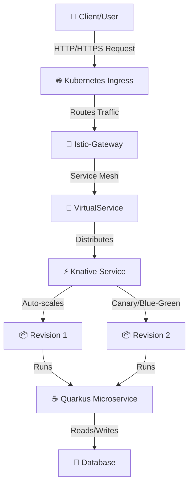

# Knative Architecture with Istio-Gateway and Quarkus

## Overview

This document describes the cloud-native serverless architecture using **Knative**, **Istio-Gateway**, and **Quarkus** microservices framework on Kubernetes.

## Architecture Diagram



## Components

### 1. **Kubernetes Ingress**
- Entry point for external traffic
- Manages SSL/TLS termination
- Routes traffic to Istio-Gateway

### 2. **Istio-Gateway**
- Service mesh ingress controller
- Advanced traffic management
- Load balancing and routing policies
- Security and authentication (mutual TLS)

### 3. **Istio VirtualService**
- Defines routing rules for traffic
- Supports traffic splitting (canary deployments)
- Connection pooling and retry policies

### 4. **Knative Service**
- Serverless platform abstraction
- Automatic scaling (0 to N replicas)
- Revision management for versioning
- Traffic splitting between revisions

### 5. **Quarkus Microservices**
- Lightweight Java framework
- Optimized for containers
- Fast startup time
- Low memory footprint

### 6. **Database**
- Persistent data storage
- PostgreSQL/MySQL/MongoDB
- Connection pooling from Quarkus apps

## Data Flow

```
User Request
    ↓
Kubernetes Ingress (SSL/TLS)
    ↓
Istio-Gateway (Service Mesh Entry)
    ↓
VirtualService (Traffic Rules)
    ↓
Knative Service (Serverless Platform)
    ↓
Auto-scaled Quarkus Pods
    ↓
Backend Processing & Database
    ↓
Response back to User
```

## Key Features

### Auto-Scaling
- **Minimum Replicas**: 0 (scales to zero when idle)
- **Maximum Replicas**: Configurable based on load
- **Metrics**: CPU, Memory, and custom metrics

### Traffic Management
- **Canary Deployments**: Gradually route traffic to new versions
- **Blue-Green Deployments**: Instant traffic switching
- **Traffic Splitting**: Distribute load across revisions

### Service Mesh Benefits
- **Circuit Breaker**: Prevents cascading failures
- **Retry Logic**: Automatic request retries
- **Timeouts**: Configurable request timeouts
- **Rate Limiting**: Traffic flow control

## Deployment Steps

### 1. Install Knative
```bash
kubectl apply -f https://github.com/knative/serving/releases/download/knative-v1.x.x/serving-crds.yaml
kubectl apply -f https://github.com/knative/serving/releases/download/knative-v1.x.x/serving-core.yaml
```

### 2. Install Istio
```bash
istioctl install --set profile=demo -y
kubectl label namespace default istio-injection=enabled
```

### 3. Configure Knative with Istio
```bash
kubectl apply -f https://github.com/knative/net-istio/releases/download/v1.x.x/release.yaml
```

### 4. Deploy Quarkus Microservice on Knative
```yaml
apiVersion: serving.knative.dev/v1
kind: Service
metadata:
  name: quarkus-microservice
spec:
  template:
    spec:
      containers:
      - image: your-registry/quarkus-app:latest
        env:
        - name: DATABASE_URL
          value: jdbc:postgresql://postgres:5432/mydb
```

### 5. Configure Istio-Gateway and VirtualService
```yaml
apiVersion: networking.istio.io/v1beta1
kind: Gateway
metadata:
  name: knative-gateway
spec:
  selector:
    istio: ingressgateway
  servers:
  - port:
      number: 80
      name: http
      protocol: HTTP
    hosts:
    - "*"
---
apiVersion: networking.istio.io/v1beta1
kind: VirtualService
metadata:
  name: quarkus-vs
spec:
  hosts:
  - "*"
  gateways:
  - knative-gateway
  http:
  - match:
    - uri:
        prefix: /api
    route:
    - destination:
        host: quarkus-microservice.default.svc.cluster.local
```

## Performance Metrics

| Metric | Value |
|--------|-------|
| **Quarkus Startup Time** | < 100ms |
| **Memory Footprint** | ~50MB per instance |
| **Knative Scale-to-Zero** | Yes |
| **Istio Overhead** | ~5-10% latency |

## Best Practices

✅ **DO:**
- Use Knative revisions for versioning
- Implement traffic splitting for safe deployments
- Monitor metrics with Prometheus and Grafana
- Use service mesh for advanced traffic control
- Configure resource limits and requests

❌ **DON'T:**
- Run Knative without a service mesh for production
- Skip health checks and readiness probes
- Use high memory requests for Quarkus apps
- Deploy without proper logging and monitoring

## Monitoring & Observability

### Tools
- **Prometheus**: Metrics collection
- **Grafana**: Visualization
- **Jaeger**: Distributed tracing
- **Kiali**: Service mesh visualization
- **Tekton**: CI/CD integration

### Key Metrics to Monitor
- Request latency (P50, P95, P99)
- Error rates
- Pod count and scaling events
- Resource utilization (CPU, Memory)

## References

- [Knative Documentation](https://knative.dev/docs/)
- [Istio Documentation](https://istio.io/latest/docs/)
- [Quarkus Documentation](https://quarkus.io/guides/)
- [Kubernetes Documentation](https://kubernetes.io/docs/)

---

**Last Updated**: April 2026
